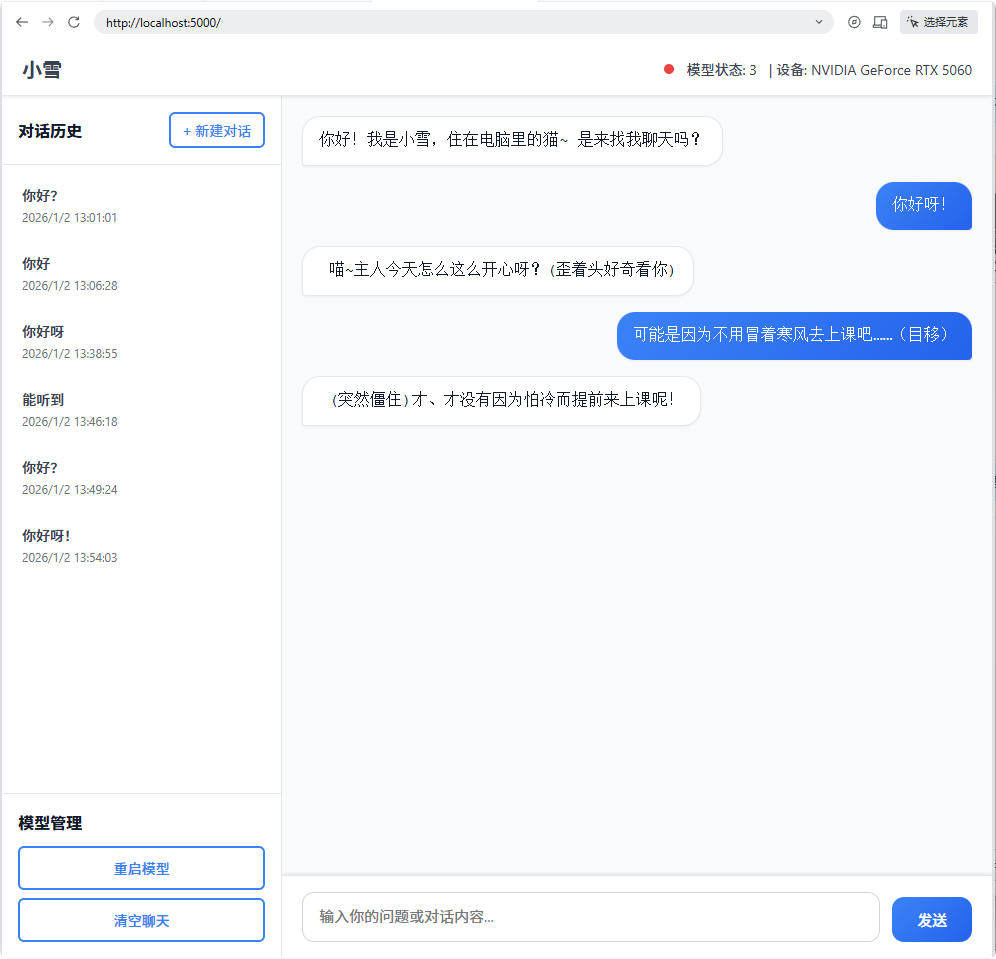

# RWKV State Tuning 实验项目 - 完整文档

## 1. 项目概述

### 1.1 项目意图

本项目是一个基于RWKV模型的轻量级、本地友好的陪伴型AI应用，旨在通过State Tuning微调技术，将RWKV7-1.5B模型训练成具有特定语言风格的对话AI，并提供简单易用的前端界面进行交互。




### 1.2 核心目标

- 使用State Tuning方式微调RWKV-7 1.5B模型，基于NekoQA-10K数据集训练出具有特定风格的对话模型
- 构建轻量、本地友好的推理应用，支持直接与微调后的RWKV模型进行自然交流

### 1.3 技术优势

- **线性注意力**：RWKV采用线性注意力机制，具有恒定的内存复杂度
- **端侧友好**：CPU、GPU均可高效推理，无需大量计算资源
- **高自由度微调**：State Tuning是RNN模型特有的上下文微调方式，能深入改变模型语言风格
- **计算成本低**：同时，相比LoRA、MiSS等微调方式，State Tuning计算成本更低
- **本地部署**：支持完全本地部署，无需依赖云服务

## 2. 项目背景与技术选型

### 2.1 模型选择

| 模型类型 | 模型名称 | 参数大小 | 优势 |
|---------|---------|---------|------|
| RWKV-7 | rwkv7-g1b-1.5b-20251202-ctx8192 | 1.5B | 线性注意力、端侧友好、8192上下文窗口，且语言能力刚好够用 |

### 2.2 微调方式选择

| 微调方式 | 优势 | 劣势 | 选择理由 |
|---------|------|------|---------|
| State Tuning | 高自由度、计算成本低、能深入改变风格 | 仅适用于RNN模型 | 最适合RWKV模型，能有效调整语言风格 |
| LoRA | 通用、模块化 | 计算成本较高 | 不符合本项目轻量设计理念 |
| MiSS | 相对lora更高效、节省资源 | 计算成本仍然较高 | State Tuning已足够满足需求，且计算成本更低 |

### 2.3 数据集选择

| 数据集名称 | 来源 | 规模 | 特点 |
|-----------|------|------|------|
| NekoQA-10K | https://huggingface.co/datasets/liumindmind/NekoQA-10K | 10,000条 | 高质量猫娘对话数据，适合训练陪伴型AI |

## 3. 项目架构与设计

### 3.1 系统架构

```
┌─────────────────────────────────────────────────────────────────┐
│                           前端界面                              │
│  ┌─────────────────┐  ┌─────────────────┐  ┌─────────────────┐  │
│  │   聊天界面      │  │  对话历史管理   │  │  模型管理       │  │
│  └─────────────────┘  └─────────────────┘  └─────────────────┘  │
└───────────────────────┬─────────────────────────────────────────┘
                        │
                        ▼
┌─────────────────────────────────────────────────────────────────┐
│                          Flask服务                              │
└───────────────────────┬─────────────────────────────────────────┘
                        │
                        ▼
┌─────────────────────────────────────────────────────────────────┐
│                         FastAPI服务                            │
│  ┌─────────────────┐  ┌─────────────────┐  ┌─────────────────┐  │
│  │   聊天接口      │  │  配置接口       │  │  状态缓存管理   │  │
│  └─────────────────┘  └─────────────────┘  └─────────────────┘  │
└───────────────────────┬─────────────────────────────────────────┘
                        │
                        ▼
┌─────────────────────────────────────────────────────────────────┐
│                          RWKV模型                               │
│  ┌─────────────────┐  ┌─────────────────┐  ┌─────────────────┐  │
│  │   模型加载      │  │  State Tuning   │  │  推理引擎       │  │
│  └─────────────────┘  └─────────────────┘  └─────────────────┘  │
└─────────────────────────────────────────────────────────────────┘
```

### 3.2 核心设计决策

1. **轻量设计**：后端采用FastAPI，前端采用Flask + 原生HTML/CSS/JS，无需复杂框架
2. **流式推理**：支持SSE (Server-Sent Events) 流式响应，提供流畅的对话体验
3. **动态生成长度控制**：基于语句结束符数量的推理终止条件，结合随机数配置，实现自然的生成长度
4. **本地友好**：支持完全本地部署，无需依赖云服务
5. **可扩展性**：预留用户自行进行State Tuning的接口

### 3.3 技术栈

| 类别 | 技术 | 版本/说明 |
|------|------|-----------|
| 后端框架 | FastAPI | - |
| 前端框架 | Flask + HTML/CSS/JS | - |
| 深度学习框架 | PyTorch | 2.8.0+cu129 |
| 模型架构 | RWKV | 7 1.5B |
| 微调方式 | State Tuning | PEFT |
| 开发语言 | Python | 3.13+ |
| 依赖管理 | pip | - |

## 4. 项目结构

```
Xue_chat/
├── backend/                   # 后端代码
│   ├── main.py               # FastAPI入口
│   ├── global_var.py         # 全局变量管理
│   ├── routes/               # API路由
│   │   ├── completion.py     # 聊天完成接口
│   │   ├── config.py         # 配置管理接口
│   │   ├── state_cache.py    # 状态缓存管理
│   │   └── ...               # 其他路由
│   ├── rwkv_pip/             # RWKV模型实现
│   │   ├── model.py          # 模型核心代码
│   │   ├── rwkv_tokenizer.py # 分词器
│   │   └── ...               # 模型相关文件
│   └── utils/                # 工具函数
│       ├── rwkv.py           # RWKV模型工具
│       ├── torch.py          # PyTorch工具
│       └── ...               # 其他工具
├── frontend/                  # 前端代码
│   ├── flask_frontend.py     # Flask服务
│   └── templates/            # HTML模板
│       └── index.html        # 聊天界面
├── requirements.txt          # 依赖列表
└── 项目文档.md                # 项目文档
```

## 5. 安装与运行

以下教程以RTX5060为例，其他GPU型号请根据实际情况调整。

### 5.1 依赖安装

1. **安装PyTorch**（CUDA 12.9版本）：
   ```bash
   pip install --force-reinstall torch==2.8.0+cu129 torchvision torchaudio -i https://pypi.tuna.tsinghua.edu.cn/simple --extra-index-url https://download.pytorch.org/whl/cu129
   ```

2. **安装其他依赖**：
   ```bash
   pip install -r requirements.txt
   ```

### 5.2 启动服务

#### 5.2.1 启动后端API服务

```bash
cd backend
python main.py --port 8000 --host 127.0.0.1
```

#### 5.2.2 启动前端服务

```bash
cd frontend
python flask_frontend.py
```

#### 5.2.3 访问应用

打开浏览器访问：http://localhost:5000

即可使用聊天界面与加载的模型对话。

## 6. API接口文档

### 6.1 聊天接口

#### 6.1.1 POST /completions

**功能**：生成模型回复

**请求体**：
```json
{
  "model": "rwkv7-g1b-1.5b-20251202-ctx8192",
  "prompt": "\nUser: 你好\nAssistant:",
  "max_tokens": 1000,
  "temperature": 0.7,
  "top_p": 0.3,
  "stream": true
}
```

**响应**：
- 流式响应，返回模型生成的文本片段
- 格式：SSE (Server-Sent Events)

#### 6.1.2 POST /api/chat (前端代理)

**功能**：前端聊天接口，代理到/completions

**请求体**：
```json
{
  "prompt": "\nUser: 你好\nAssistant:"
}
```

**响应**：
- 流式响应，返回模型生成的文本片段

### 6.2 配置接口

#### 6.2.1 POST /update-config

**功能**：更新模型配置

**请求体**：
```json
{
  "state": "path/to/state-tuning-file.pth"
}
```

### 6.3 模型管理接口

#### 6.3.1 POST /api/restart-model (前端代理)

**功能**：重启模型

**响应**：
```json
{
  "status": "success",
  "message": "Model restarted successfully"
}
```

## 7. 模型微调流程

本项目所使用的模型为rwkv7-g1b-1.5b-20251202-ctx8192.pth，微调代码已置于当前仓库的[peft分支](https://gitee.com/Lynlane/neko-chat-rwkv/tree/peft/)，可参考该分支代码及参数配置内容进行微调。

其他模型微调流程请参考官方文档：https://www.rwkv.cn/tutorials/advanced/Fine-Tune/RWKV-PEFT/State-Tuning


### 7.1 数据准备

1. **下载数据集**：
   ```bash
   from datasets import load_dataset
   dataset = load_dataset("liumindmind/NekoQA-10K")
   ```

2. **清洗数据**：
   - 去除重复数据
   - 转换为RWKV-PEFT所需格式
   - 过滤无效对话

3. **格式转换**：
   ```json
   {
     "text": "\nUser: 你好\nAssistant: 你好呀！我是小雪，住在电脑里的猫~\n"
   }
   ```

### 7.2 模型下载

- 下载基础模型：rwkv7-g1b-1.5b-20251202-ctx8192.pth
- 下载地址：[RWKV官方模型仓库](https://www.rwkv.cn/tutorials/basic/Model-Download)

### 7.3 微调训练

使用官方RWKV-PEFT代码进行State Tuning：

```bash
python train.py --peft state --model rwkv7-g1b-1.5b-20251202-ctx8192.pth --data nekoqa-10k.json --ctx_len 8192 --batch_size 1
```
模型对应的具体参数详见官方文档：https://www.rwkv.cn/tutorials/advanced/Fine-Tune/RWKV-PEFT/State-Tuning


或者使用本项目peft分支中的train.py进行微调。


### 7.4 模型导出

- 导出State Tuning结果：rwkv-state-tuning-NekoQA-10K-1.5B.pth
- 该文件包含微调后的state矩阵，用于推理时加载

## 8. 前端界面使用

### 8.1 聊天功能

1. 在输入框中输入对话内容
2. 点击"发送"按钮或按Enter键发送
3. 等待模型生成回复（支持流式显示）
4. 可在侧边栏查看对话历史

### 8.2 模型管理

- **重启模型**：点击"重启模型"按钮，重新加载模型和State Tuning文件
- **清空聊天**：点击"清空聊天"按钮，清空当前对话
- **新建对话**：点击"新建对话"按钮，开始新的对话

### 8.3 状态显示

- 顶部状态栏显示模型状态（在线/加载中/离线）
- 显示当前使用的设备信息

## 9. 技术亮点与创新

### 9.1 State Tuning实现

- 基于RWKV模型的state矩阵进行微调
- 支持动态加载和切换State Tuning文件
- 实现了高效的state管理机制

### 9.2 动态生成长度控制

- **创新点**：基于语句结束符数量的推理终止条件
- **实现方式**：
  1. 初始化标点符号计数器
  2. 根据概率分布随机选择停止标点数量：2个（20%），3个（30%），4个（20%），5个（30%）
  3. 统计生成文本中与语句结束直接相关的标点符号数量（`！` `？` `）` `~`）
  4. 当达到指定数量时，停止生成
- **优势**：避免输出过长或长度僵化，实现对数据集内容更深程度的拟合

### 9.3 流式推理

- 支持SSE (Server-Sent Events) 流式响应
- 实现了前端流式接收和显示
- 提供流畅的对话体验

### 9.4 轻量设计

- 后端代码结构清晰，易于维护
- 前端采用原生HTML/CSS/JS，无需复杂框架
- 支持本地部署，无需依赖云服务

### 9.5 可扩展性

- 支持多种RWKV模型版本
- 预留了用户自行进行State Tuning的接口
- 支持模型配置动态调整

## 10. 性能指标

| 指标 | 值 | 说明 |
|------|-----|------|
| 模型大小 | 1.5B | 参数数量 |
| 上下文长度 | 8192 | 支持的最大上下文窗口 |
| 推理速度 (GPU) | ~80 tokens/s | RTX 5060 |
| 推理速度 (CPU) | ~10 tokens/s | Intel i5-12600K |
| 内存占用 (GPU) | ~2.3GB | 推理时显存占用 |
| 微调时间 | ~30min | 3轮训练，RTX5060  |
| 响应延迟 | <100ms | 首次响应延迟 |

## 11. 发展计划

### 11.1 短期计划

- 优化前端界面，提升用户体验
- 支持更多微调方式（如LoRA、MiSS）
- 实现模型量化，进一步降低资源占用
- 支持多语言对话

### 11.2 长期计划

- 支持多模型并行推理
- 实现模型微调的Web界面
- 支持自定义数据集训练
- 开发移动端适配版本
- 支持语音输入输出

## 12. 代码示例

### 12.1 推理代码核心逻辑

```python
async def eval(model, request, body, prompt, stream, stop, chat_mode):
    # 初始化标点符号计数器和停止条件
    punctuation_count = 0
    
    # 根据概率分布随机选择停止标点数量
    rand = random.random()
    if rand < 0.2:
        stop_symbol_count = 2
    elif rand < 0.5:
        stop_symbol_count = 3
    elif rand < 0.7:
        stop_symbol_count = 4
    else:
        stop_symbol_count = 5
    
    try:
        # 使用生成器生成文本
        for response_type, response, delta, prompt_tokens, completion_tokens in model.generate(body, prompt, stop=stop):
            # 统计标点符号数量
            current_punctuation = delta.count('!') + delta.count('！') + delta.count('?') + delta.count('？') + delta.count(')') + delta.count('）') + delta.count('~')
            punctuation_count += current_punctuation
            
            # 检查是否达到停止条件
            if punctuation_count >= stop_symbol_count:
                print(f"Stop generation: punctuation count {punctuation_count} reached limit {stop_symbol_count}")
                break
                
            # 流式返回结果
            if stream:
                yield json.dumps({
                    "object": "chat.completion.chunk" if chat_mode else "text_completion",
                    "model": model.name,
                    "choices": [{
                        "delta": {"content": delta},
                        "index": 0,
                        "finish_reason": None,
                    } if chat_mode else {
                        "text": delta,
                        "index": 0,
                        "finish_reason": None,
                    }]
                })
    except Exception as e:
        print(e)
        pass
```

### 12.2 前端聊天功能实现

```javascript
async function sendMessage() {
    const input = document.getElementById('prompt-input');
    const prompt = input.value.trim();
    if (!prompt) return;
    
    // 构建简洁的提示词
    const fullPrompt = `\nUser: ${prompt}\nAssistant:`;
    
    // 显示用户消息
    const userMessage = document.createElement('div');
    userMessage.className = 'message user';
    userMessage.innerHTML = `<pre>${escapeHtml(prompt)}</pre>`;
    chatMessages.appendChild(userMessage);
    
    // 发送请求获取模型回复
    try {
        const response = await fetch('/api/chat', {
            method: 'POST',
            headers: {
                'Content-Type': 'application/json'
            },
            body: JSON.stringify({ prompt: fullPrompt })
        });
        
        // 处理流式响应
        const reader = response.body.getReader();
        const decoder = new TextDecoder('utf-8');
        
        // 读取流式数据
        let done = false;
        while (!done) {
            const { value, done: doneReading } = await reader.read();
            done = doneReading;
            
            if (value) {
                const chunk = decoder.decode(value, { stream: true });
                // 处理SSE事件
                const events = chunk.split('\n\n');
                
                for (const event of events) {
                    if (event.trim()) {
                        // 解析并显示模型回复
                        // ...
                    }
                }
            }
        }
    } catch (error) {
        console.error('Stream error:', error);
    }
}
```

## 13. 常见问题与解决方案

### 13.1 模型加载失败

**问题**：启动服务后，模型无法加载

**解决方案**：
- 检查模型文件路径是否正确
- 确保PyTorch版本与模型兼容
- 检查CUDA驱动是否正确安装

### 13.2 推理速度慢

**问题**：模型推理速度较慢

**解决方案**：
- 确保使用GPU进行推理

## 14. 总结与展望

本项目成功实现了一个基于RWKV模型的轻量级、本地友好的陪伴型AI应用。通过State Tuning微调技术，将RWKV-7 1.5B模型训练成具有猫风格的对话AI，并提供了简单易用的前端界面进行交互。

项目的核心创新点在于：
1. **使用State Tuning方式对RWKV模型进行微调，实现了高效的风格迁移**
2. **基于语句结束符数量的动态生成长度控制，提高了生成文本的自然度，同时避免引入更大模型**
3. 轻量设计，支持完全本地部署
4. 流式推理，提供流畅的对话体验

未来，项目将继续优化前端界面，支持更多微调方式，实现模型量化，进一步降低资源占用，并支持多语言对话、语音输入输出等功能，为用户提供更好的使用体验。

## 15. 参考文献

1. RWKV官方文档：https://github.com/BlinkDL/RWKV-LM
2. RWKV-PEFT代码：https://github.com/Joluck/RWKV-PEFT
3. NekoQA-10K数据集：https://huggingface.co/datasets/liumindmind/NekoQA-10K
4. PyTorch官方文档：https://pytorch.org/docs/stable/index.html
5. FastAPI官方文档：https://fastapi.tiangolo.com/
6. Flask官方文档：https://flask.palletsprojects.com/

---

**项目链接**：https://gitee.com/Lynlane/neko-chat-rwkv/tree/peft/
